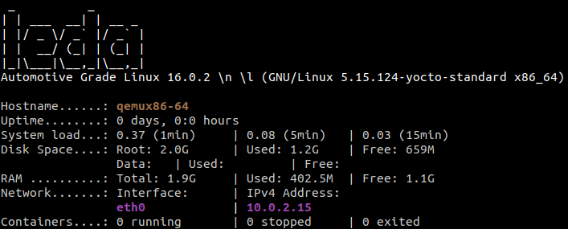
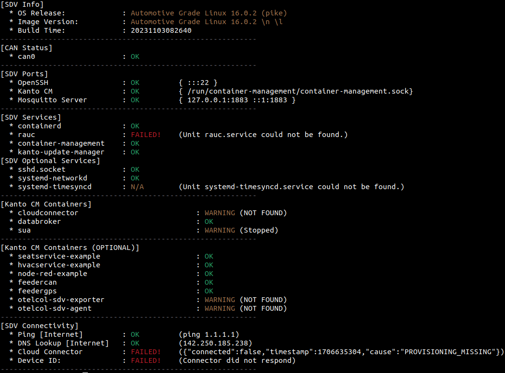

# Eclipse Leda on Automotive Grade Linux (AGL)

[Automotive Grade Linux](https://www.automotivelinux.org/)
    ·
[Meta Leda](https://github.com/eclipse-leda/meta-leda)

## Overview

Eclipse Leda and AGL are both operating systems for the automotive domain.
Both rely on the Yocto/BitBake toolchain and provide OpenEmbedded layers containing multiple recipes.
AGL primarily started in infotainment, whereas Eclipse Leda is an integration platform for different Eclipse SDV technologies,
such as the KUKSA Databroker or Eclipse Kanto.
There is some overlap between both OS regarding software/firmware update strategies.

This manual allows to build and run components of the Eclipse Leda project (namely recipes from the meta-leda meta layer)
on top of the AGL base image.

> 📝 Note: The integration is tested with AGL version prickly pike 16.0.2

## Prerequisites

In order to prepare the build, first install the [repo CLI](https://source.android.com/docs/setup/create/repo).

## Getting started

Install git submodules for AGL manifest.

```bash
git submodule init
git submodule update
```

Next, include the following meta layers into the repo manifest by changing the [repo manifest file](AGL-repo/pike_16.0.2.xml):

* Meta-Rauc
* Meta-Leda
* Meta-Kanto
* Meta-lts-mixins-go

As AGL is built on top of the Yocto Project and currently utilizes Yocto Kirkstone, all components
we incorporate must be compatible with older versions of Yocto. Consequently, each of the four projects we aim to integrate
maintains dedicated branches tailored to the Yocto Kirkstone version.
Utilizing the milestone [M03](https://github.com/eclipse-leda/leda-distro/releases/tag/v0.1.0-M3) of the Eclipse Leda project, we can test the integration by executing the
[companion-application](https://github.com/eclipse-sdv-blueprints/companion-application/blob/main/interact-seat-adjuster.md#run-kuksa-client)
example.

```xml
<!-- meta-lts-mixins-go -->
<project name="meta-lts-mixins" path="external/meta-lts-mixins-go" remote="yocto" revision="a0384aea22a3ddfc70202a26ee1372c91b1fcfc9" upstream="kirkstone/go" />
    
<!-- meta-kanto -->
<project name="eclipse-kanto/meta-kanto" path="external/meta-kanto" remote="github" revision="7a3dcd355b88c70b7cfa6b37948c7eb7c5b00c7e" upstream="kirkstone" />

<!-- meta-leda -->
<project name="eclipse-leda/meta-leda" path="external/meta-leda" remote="github" revision="3f7e21a8484862076d4992d9463b3ce7aa2cbad0" upstream="kirkstone" />

<!-- meta-rauc -->
<project name="rauc/meta-rauc" path="external/meta-rauc" remote="github" revision="9e206d6998b363315791be144815a4eabc3fe5a8" upstream="kirkstone" />
```

> 📝 Some Background: We need to add the lts-mixins-go layer to install a newer Golang version to compile the meta-kanto layer.

Unfortunately, this only takes effect after making a new commit on a new branch inside the AGL-repo submodule.

```bash
cd AGL-repo
git checkout -b leda-integration
git add .
git commit -m "Add Eclipse Kanto and Eclipse Leda meta layers"
```

Now, let us initialize the repo tool.

```bash
repo init -u ./AGL-repo -b leda-integration -m pike_16.0.2.xml
repo sync
```

Initialize the bitbake environment like this:

```bash
source meta-agl/scripts/aglsetup.sh -m qemux86-64 agl-demo agl-netboot
```

Now, let us extend the `bblayers.conf` file with some configuration.

```bash
BBLAYERS =+ " \
    ${METADIR}/external/meta-virtualization \
    ${METADIR}/external/meta-kanto \
    ${METADIR}/external/meta-leda/meta-leda-backports \
    ${METADIR}/external/meta-rauc \
    ${METADIR}/external/meta-leda/meta-leda-components \
    "
```

Finally, we can edit the local.conf bitbake configuration like this:

```bash
INHERIT += "rm_work"

DISTRO_FEATURES:append = " sdv virtualization git containerd rauc"
DISTRO_VERSION = "2022"

IMAGE_ROOTFS_EXTRA_SPACE:append = " + 8000000"

# Configure the kernel modules required to be included
MACHINE_ESSENTIAL_EXTRA_RRECOMMENDS += "kernel-modules"

# System initialization manager setup
VIRTUAL-RUNTIME_init_manager = "systemd"
DISTRO_FEATURES_BACKFILL_CONSIDERED = "sysvinit"
VIRTUAL-RUNTIME_initscripts = "systemd-compat-units"

# Add the Eclipse Kanto components
# leda-utils, blueprint-selector, kantui, kanto-auto-deployer, sdv-databroker-cli
IMAGE_INSTALL:append = " suite-connector container-management update-manager leda-utils blueprint-selector kantui kanto-auto-deployer jq"
```

> 📝 Note: The jq recipe is optional since we only use it to test the Kuksa client.
> By utilizing the `IMAGE_ROOTFS_EXTRA_SPACE` variable, we allocate additional disk space for all containers deployed through Eclipse Kanto.

## Build the image

### macOS

BitBake does not natively run on macOS. Therefore, it is necessary to either use a Linux VM or a preconfigured
container image named [crops](https://github.com/crops/poky-container), provided by the Yocto community.
This repository contains a [Dockerfile](./Dockerfile) which extends the crops base image, e.g., by the repo CLI so that it does
not need to be installed manually.

Build the crops based image

```bash
docker build -t agl-build-image .
```

Follow the [crops for Mac tutorial](https://github.com/crops/docker-win-mac-docs/wiki/Mac-Instructions) and create a volume and Samba server to mount the volume into the host machine.

```bash
docker volume create --name agl-volume
docker run -it --rm -v agl-volume:/workdir busybox chown -R 1000:1000 /workdir

docker create -t -p 445:445 --name samba -v agl-volume:/workdir crops/samba
docker start samba

sudo ifconfig lo0 127.0.0.2 alias up
```

Start a container running the crops image

```bash
docker run --rm -it -v agl-volume:/workdir agl-build-image --workdir=/workdir
```

Inside the container it is possible to continue the remaining prerequisites.

### Linux

We can now use bitbake to build our image by running `bitbake agl-demo-platform`.
When you run this command on a Linux machine, the build should succeed.
To get an isolated environment, you can use the Docker crops image described in the macOS section.
Just build the image and start the container at the root of this project like this:

```bash
docker run --rm -it -v $(pwd):$(pwd) crops/poky:ubuntu-22.04 --workdir=$(pwd)
```

Don't forget to source the environment inside the build directory `source build/agl-init-build-env` in order to use the
bitbake command.

Once the build has finished, run the image using qemu.

## Run the image

```bash
qemu-system-x86_64 \
    -kernel bzImage \
    -hda agl-demo-platform-qemux86-64.ext4 \
    -m 4096 \
    -cpu qemu64,+ssse3,+sse4.1,+sse4.2,+popcnt \
    -vga none -device virtio-gpu-pci \
    -device virtio-rng-pci \
    -serial mon:stdio -serial null \
    -net nic \
    -net user,hostfwd=tcp::2222-:22 \
    -nographic \
    -append "root=/dev/sda console=ttyS0 video=vesafb"
```

There is also a convenient wrapper around the qemu command:

```bash
runqemu tmp/deploy/images/qemux86-64/agl-demo-platform-qemux86-64.qemuboot.conf kvm serialstdio slirp publicvnc
```

Note that you have to source the environment file inside the build directory for using this command:

`source build/agl-init-build-env`.

After starting the image with qemu, you can log in via the user `root` and execute `osd-health` for a quick health check
of the running instance.

You are now able to start the example applications via `kanto-auto-deploy /var/containers/manifests`.

## Versions overview

| Component          | Version             | Branch       | Commit                                    | Repository                                                                                                       |
|--------------------|---------------------|--------------|-------------------------------------------|------------------------------------------------------------------------------------------------------------------|
| AGL                | Prickly Pike 16.0.2 | kirkstone    | Ia6b326973619f34911200f77bfa63abed01daad8 | [Gerrit](https://gerrit.automotivelinux.org/gerrit/gitweb?p=AGL%2FAGL-repo.git;a=shortlog;h=refs%2Fheads%2Fpike) |
| Eclipse Leda       | Milestone 0.1.0-M3  | kirkstone    | 3f7e21a8484862076d4992d9463b3ce7aa2cbad0  | [Github](https://github.com/eclipse-leda/meta-leda/releases/tag/0.1.0-M3)                                        |
| Eclipse Kanto      | latest on branch    | kirkstone    | 7a3dcd355b88c70b7cfa6b37948c7eb7c5b00c7e  | [Github](https://github.com/eclipse-kanto/meta-kanto/tree/kirkstone)                                             |
| Meta-lts-mixins-go | latest on branch    | kirkstone/go | a0384aea22a3ddfc70202a26ee1372c91b1fcfc9  | [Github](https://git.yoctoproject.org/meta-lts-mixins/log/?h=kirkstone/go)                                       |

## Target state

If everything was building correctly and the image is bootable, after loggin in into the root user, the output should look
like shown in the screenshot below:



In case you used the `kanto-auto-deploy` command to utilize and deploy the integrated container manifests,
the output of `sdv-health` should look like this:



> 📝 At present, no efforts have been undertaken to integrate
> Rauc and the update mechanisms. The primary emphasis has remained on integrating the core components of Eclipse Leda.
> Additionally, the cloud connector was not configured or provisioned.
