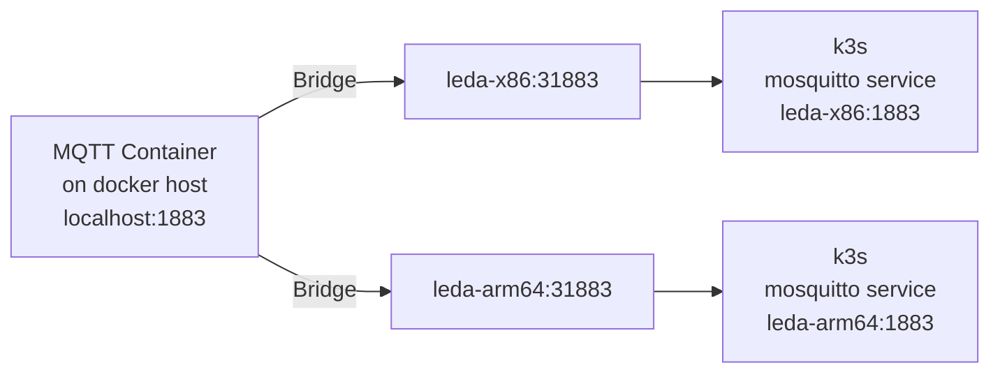

# Eclipse Leda Docker Compose for Users

This is a docker compose setup which uses published container images from the ghcr.io container registry.
Building the images is not necessary.

## Usage

Starting the containers with:

    docker compose up -d 

Log in to a development shell inside of the docker network:

    docker compose run devshell

Stopping the containers:

    docker compose down

## Docker Compose Services

Checking all containers are running or exited successfully:

    $ docker compose ps
    NAME                 COMMAND                  SERVICE              STATUS               PORTS
    leda-bundle-server   "/docker-entrypoint.…"   leda-bundle-server   running (starting)   0.0.0.0:8080->80/tcp, :::8080->80/tcp
    leda-devshell        "/bin/sh -c /root/le…"   devshell             running              
    leda-dns-proxy       "dnsmasq -k"             dns-proxy            running              53/tcp, 0.0.0.0:5353->53/udp, :::5353->53/udp
    leda-initializer     "/bin/sh -c /root/le…"   leda-initializer     exited (0)           
    leda-mqtt-broker     "/docker-entrypoint.…"   mqtt-broker          running (starting)   0.0.0.0:1883->1883/tcp, :::1883->1883/tcp
    leda-x86             "/docker/leda-quicks…"   leda-x86             running (starting)   22/tcp, 31883/tcp, 0.0.0.0:1443->6443/tcp, :::1443->6443/tcp

## Network setup

As the networking is complicated to set up with emulated network inside of qemu, forwarding it to the Docker network, the following explanation is helpful to understand networking better.

- All docker compose containers are attached to a network called `leda-bridge` and can see each other
- The qemu instances use a TAP network inside of each leda-quickstart-xxx container and do a NAT network translation to their own container
- The Docker internal DNS server is being

## Developer Shell

Developer Shell:

    docker compose run devshell

From there, you can log in to either Leda on QEMU x86-64, or log in to Leda on QEMU ARM-64.

    ssh leda-x86
    ssh leda-arm64

## Interacting with Eclipse Leda

1. Check the general system status

    sdv-health

### Device Provisioning

1. Run the provisioning script:

    sdv-provision

2. Copy the fingerprints

3. Go to Azure IoT Hub, create a new device

4. Use the certificate's common name (CN) as Device Id - on Leda, this defaults to a part of the MAC Address

5. Select `X.509 Self-Signed` authentication type and enter both fingerprints

6. Click Save

### Sending C2D Messages to a connected device

Use `send-message.sh` to send an Azure C2D Message via an IoT Hub to the device. This example script will trigger a Self Update bundle installation.

### MQTT Broker Bridge

The Docker Compose setup will also start an Eclipse Mosquitto message broker as a bridge to both Leda instances.
This allows a user or developer to monitor messages sent by or received by both virtual devices.

Connect your MQTT client to `mqtt-broker.leda-network` by using the exposed port 1883 on the host:

    mosquitto_sub -h localhost -p 1883 -t '#'

# Networking

You need to enable IP forwarding from Docker containers to make networking work.
The containers (leda-arm64, leda-x86) need to run with ``--privileged`` as they change iptables rules for proper forwarding of network packets.

https://docs.docker.com/network/bridge/#enable-forwarding-from-docker-containers-to-the-outside-world

    sudo sysctl net.ipv4.conf.all.forwarding=1
    sudo iptables -P FORWARD ACCEPT

Each Eclipse Leda instance (ARM64, x86_64) is running within a QEMU emulated network (192.168.7.2), which itself is contained
in a containerized network called `leda-network` (192.168.8.x).

The containers wrapping the QEMU instances will forward the following ports to the respective QEMU process:
- SSH on port 2222
- Mosquitto on port 1883

## DHCP and DNS setup

Each Leda-QEMU container is running a local DHCP on the `tap0` network interface and listens for DHCP requests by the Leda Distro running inside of QEMU.
The DHCP server will respond with the same IP address (`192.168.7.2`) to the request from QEMU.

The DHCP response contains a DNS nameserver pointing to the `dns-proxy.leda-network` (`192.168.8.14`) IP, which in turn forwards to Docker's internal `127.0.0.11` nameserver.
This allows the QEMU guests to resolve Docker Compose Services by their service name, e.g. `leda-bundle-server.leda-network`.

## Volumes

The `/root` path inside of the Leda containers is mounted as a volume and contains the raw disk image and runner scripts for the QEMU Leda distribution.
Changes on the QEMU filesystem are made persistent on a copy of the QCOW2 disk image, so that restarting the device will keep any changes.

To reset to the original state, delete the respective docker volumes and restart the containers:

    docker compose down
    docker compose rm --force --stop --volumes
    docker volume rm leda-arm64
    docker volume rm leda-x86

# Troubleshooting

If login to Leda Docker DevShell does not work, or if you want to attach directly into the container running QEMU, you need to execute a one-off command shell in the running container:

    docker compose exec leda-x86 /bin/bash

When the building of the Docker containers fails as there is no access to the latest release artifacts or build artifacts, you may want to set the current GITHUB_REPOSITORY variable to your own build repository, before running the run-docker.sh script:

    export GITHUB_REPOSITORY="MyGithubOrg/my-leda-distro-fork"
    ./run-docker.sh

# Profiles

Profiles can be used to determine which containers (services) docker compose should be starting by default.
This is mostly used to have the `devshell` container not start up by default.
- `tools`: Contains docker containers which are not essential at runtime, must useful for testing and development purposes

# Metrics Dashboards

- Prometheus is used to collect data from the containers
- procexporter is used to monitor the QEMU instances (CPU + Memory)
- Grafana is used to visualize. Open http://localhost:3000/ to see dashboard
