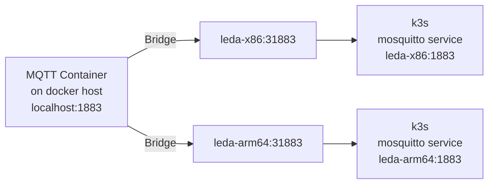

# Eclipse Leda - Docker Builds

This repository contains a docker-compose file and Dockerfiles for running Eclipse Leda instances
and needed infrastructure within docker for testing and evaluation purposes.

Pre-Requisites:
- A recent Docker and Docker Compose Plugin version (compose file is using build secrets).
- A potent host machine, e.g 16 vCPU, 32 GB RAM

# Plain Docker

If you want to run a single instance, without the MQTT or WebServer infrastructure, you can do so by running a single Docker container directly:

    docker run --privileged ghcr.io/eclipse-leda/leda-distro/leda-x86

# Docker Compose - General Usage

Starting up Docker Compose:

    ./run-docker.sh

Shutting down Docker Compose:

    ./stop-docker.sh

## Developer Shell

Developer Shell:

    docker compose run devshell

From there, you can log in to either Leda on QEMU x86-64, or log in to Leda on QEMU ARM-64.

    ssh leda-x86
    ssh leda-arm64

# Interacting with Eclipse Leda

### Local Device Provisioning

Use `docker-provision.sh` to initiate the device provisioning. The script will use Azure CLI and SSH to configure the cloud connector in the Leda instances.

### Sending C2D Messages to a connected device

Use `send-message.sh` to send an Azure C2D Message via an IoT Hub to the device. This example script will trigger a Self Update bundle installation.

### MQTT Broker Bridge

The Docker Compose setup will also start an Eclipse Mosquitto message broker as a bridge to both Leda instances.
This allows a user or developer to monitor messages sent by or received by both virtual devices.

Connect your MQTT client to `mqtt-broker.leda-network` by using the exposed port 1883 on the host:

    mosquitto_sub -h localhost -p 1883 -t '#'

# Networking

You need to enable IP forwarding from Docker containers to make networking work.
The containers (leda-arm64, leda-x86) need to run with ``--privileged`` as they change iptables rules for proper forwarding of network packets.

https://docs.docker.com/network/bridge/#enable-forwarding-from-docker-containers-to-the-outside-world

    sudo sysctl net.ipv4.conf.all.forwarding=1
    sudo iptables -P FORWARD ACCEPT

Each Eclipse Leda instance (ARM64, x86_64) is running within a QEMU emulated network (192.168.7.2), which itself is contained
in a containerized network called `leda-network` (192.168.8.x).

The containers wrapping the QEMU instances will forward the following ports to the respective QEMU process:
- SSH on port 22
- Mosquitto on port 31883
- Kubernetes API on port 6433

## Leda Initializer and proper DNS setup

The `leda-initializer` docker container will reconfigure the quickstart containers (leda-arm64, leda-x86) to use the internal DNS Proxy (leda-dns-proxy).
The internal DNS proxy is a proxy which will redirect DNS requests first to the docker-built-in DNS server, so that other containers can be resolved
using their service name. Requests outside of the `.leda-network` will be routed to the host's nameservers by default, allowing the quickstart images
to resolve external domains.

The manually reconfigure the network, e.g. when running containers without Docker Compose, the DNS reconfiguration is as follows:
Run these commands on the QEMU instance and replace `DNS_PROXY_IP` with the IP Address of the DNS Proxy.

*Important Note: The IP Address must be reachable from `leda-network`, it **must not** be the default Docker DNS Service running in 127.0.0.11, as this interface is not reachable from within the QEMU instance.

        DNS_PROXY_IP=$(dig dns-proxy.leda-network +short)
        systemd-resolve --interface eth0 --set-dns ${DNS_PROXY_IP} --set-domain leda-network"
        systemctl restart systemd-resolved

# Profiles

There are two profiles currently:
- `tools`: Contains docker containers which are not essential at runtime, must useful for testing and development purposes
- `experimental`: Docker containers which are not yet tested or which are currently unstable or even unusable.

# Metrics Dashboards

- Prometheus is used to collect data from the containers
- procexporter is used to monitor the QEMU instances (CPU + Memory)
- Grafana is used to visualize. Open http://localhost:3000/ to see dashboard
